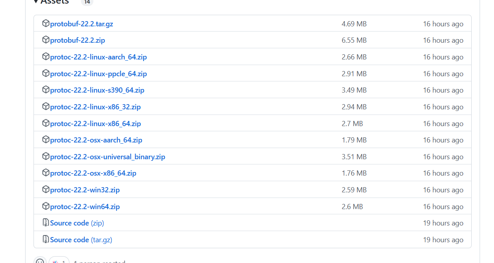
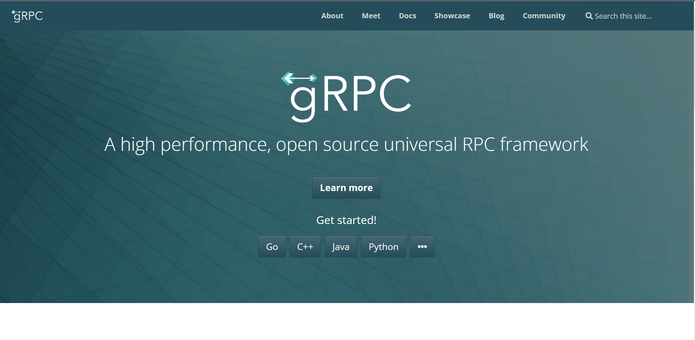

## protobuf 
官网：https://protobuf.dev/

安装 protoc https://github.com/protocolbuffers/protobuf/releases

## 安装 grpc 

官网：https://grpc.io/

安装对应工具：

 

选择 Go 语言

## 编写 proto 文件

[点击查看 proto 文件](https://grpc.io/)

## 生成 message 代码

protoc --go_out=. ping.proto 

[点击查看 ping.db.go 文件](./servcer/ping.db.go)

## 生成 rpc 代码

protoc --go-rpc_out=. ping.proto

[点击查看 ping_grpc.db.go 文件](./servcer/ping_grpc.db.go)

